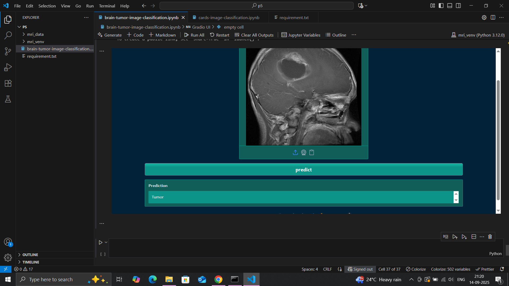

# Brain Tumor MRI Classification with CNN
This project implements a Convolutional Neural Network (CNN) using TensorFlow/Keras to classify MRI images into two categories:
1. Healthy Brain
2. Tumor (Glioma)
The goal is to assist in the early detection of brain tumors through deep learning–based image classification.

## Features

Lightweight CNN architecture (easy to train).
Works with variable image sizes (resized internally).
Binary classification (Healthy vs Tumor).


### first brain pic of classification photo


### Second brain pic of classification photo


### Third brain pic of classification photo


### Create and activate a virtual environment
```
conda create -p mri_venv python==3.12 -y

conda activate mri_venv/

```
### install dependencies
```
pip install -r requirements.txt

```
### Git commands

```
1. git init

2. git add .  or git add README.md notebook text files

3. git commit -m "first commit"

4. git remote remove origin

5. git remote add origin https://github.com/shivarajshelar/card_classification.git

6. git remote -v

7. git branch -M main

8. git push -u origin main

```
## Library are used for this project

1. Pandas
2. Numpy
3. Tensorflow
4. Gradio
5. Matplotlib
6. seaborn
7. pillow

